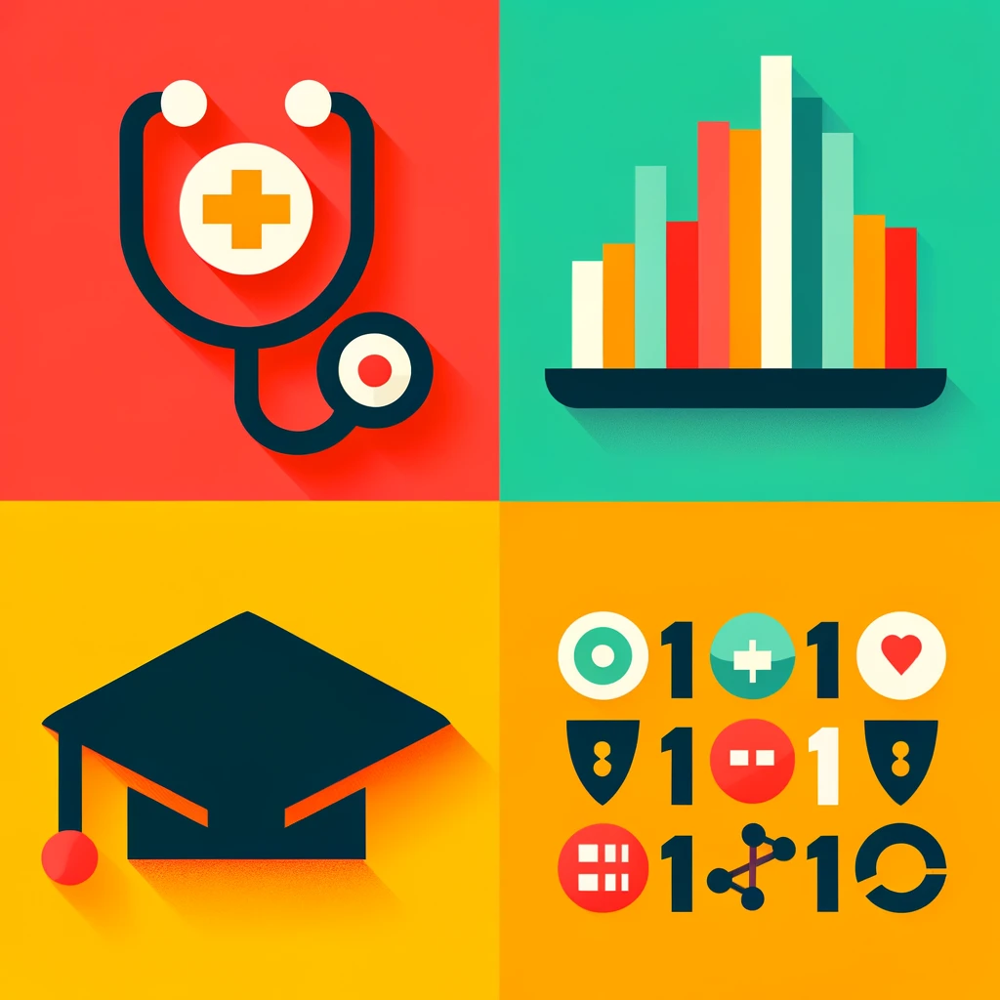

## Reflection

  This website was built using <a href="https://quarto.org/" class="custom-alert-link">Quarto, </a> an open-source scientific and technical publishing system. Check it out!

  Here is an example of a <a href="https://pythonhealthdatascience.github.io/stars-simpy-jupterlite/lab/index.html" class="custom-alert-link">simulation model </a> developed in Python and deployed using JupyterLite. Click on 01_urgent_care_model.ipynb. The code is interactive or you can run the whole model using the baseline parameters and generate reproducible outputs. With thanks to Tom Monks.

I am interested in different ways that technology can be used to support education. I am also conscious that we are increasingly being overwhelmed with digital information and demands. We have unparalleled access to information, interactive learning experiences, and innovative teaching tools. From online courses, and digital textbooks, to interactive simulations and AI-driven personalised learning, technologty supports education in numerous ways. However, this proliferation of digital offerings also brings the risk of information overload digital fatigue, which can hinder the learning process rather than enhance it.
  
Nonetheless, there are opportunities to make education more accessible, breaking down geographical barriers and providing resources to students regardless of their location and resources. WebAssembly provides such an opportunity. Simulation is an employable skill, but access to commercial packages holds cost barriers, while access to code in, for example, Python or R, setting up dependency management, and running the code without issues presents technical barriers. I can see how WebAssembly can support both healthcare users to implement models as research outputs. I believe it to be a useful technology to support students of simulation, in particular those who are 'users' of simulation, rather than 'developers'. Business Analytics students in the Business School are good examples of students who may benefit from this technology. They can quickly pick up enough code to clean, pre-process data and explore data, and implement simple analyses. More complex analyses, such as simulation needs more time to learn the theory of simulation, code the model, interact with the model, debug, generate and interpret results etc. By using a method that improves model accessibility, students can focus on learning the method, and interacting with code without concern of being unable to get it running on their device, breaking the code, or getting too deeply concerned about what the code is doing and forgetting to focus on the modelling principles.

This is a bit technical because I intend to write it up as a paper (WebAssembly is not used in healthcare M\&S research, but has great potential to improve model accessibility and help to make simulation modelling a method that is useful and impactful for supporting healthcare service planning.

Finally, I used Quarto for two reasons. Partly, it was an opportunity to put a Quarto website into practice - as another potentially excellent resource for both research and education. It has endless potential for delivering and presenting material to a wide variety of audiences. Secondly, I wanted to demonstrate WebAssembly in practice - embedded in the Introduction with some fun examples, and above, as link to a simulation model of an urgent care centre, to illustrate its application in practice. More details of the simulation model can be found [here.](https://pythonhealthdatascience.github.io/stars-simpy-example-docs/content/front_page.html)

